  

经验值 42% —— 距离升级还需持续挖矿

---

## 玩 家 档 案

> **JeasonLoop** `Lv.27` 
> 主世界：中国 ｜ 职业：前端学徒 
> 状态：摸鱼中... ｜ 补给：咖啡充足

## Agent 阵容

 **Pi** &nbsp;·&nbsp;
 **Codex** &nbsp;·&nbsp;
 **Claude** &nbsp;·&nbsp;

---

## 附魔台 · 已附魔

### 待附魔 · 计划学习

### 装 备 栏

---

## 合 成 台

> `JavaScript` ＋ `CSS` ＋ `咖啡 ×3` ＋ `好奇心` → **JeasonLoop** 
> 合成成功率 99%（剩下 1% 是 bug）

## 冒 险 进 度

  
  
  
   
  

---

## 成 就 系 统

未解锁成就：继续探索中...

## 村 民 交 易

> 你提供：`好想法` ＋ `绿宝石` → 我提供：`一起写代码 / 互相学习` 
> 交易通道：[GitHub Issues](https://github.com/JeasonLoop)

---

  
   
  
  &nbsp;
  

